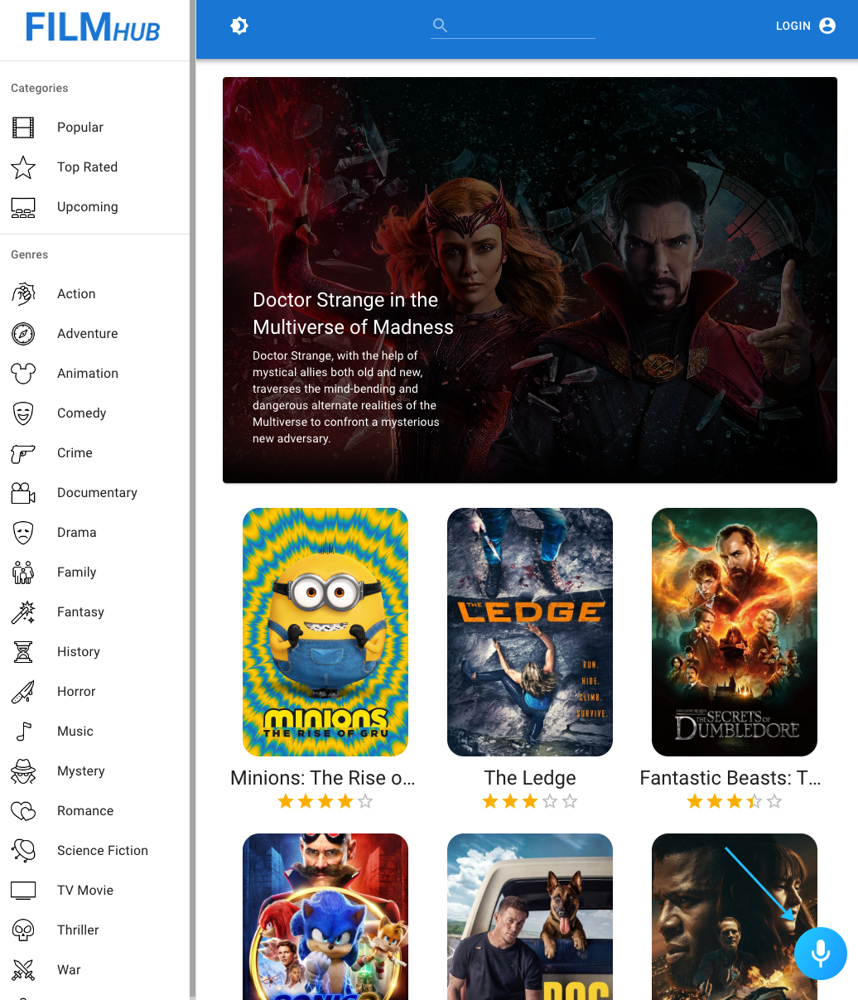

# FilmHub webpage created with Vite & React

## Introduction

This application is part of a course taught by JSM. As an addition to it, I have migrated the application to React Router V6, changed the directory structure, used Vite for building the app and fixed some bugs with the layout.

The login is managed by the [TMDB](https://www.themoviedb.org/) team, being able to add films to your watchlist and favourite lists.

To run the app you have to execute the yarn command on the cli, get an API key and write it to the **.env** file.

## Technologies

To building the website I've used React with React Router V6 and Redux Toolkit. For the style I have used Material UI and implemented a voice assistant with Alan AI.

### Alan AI

The project implements a Conversational Voice AI Platform called Alan AI.

You can talk with the voice assistant by clicking the mic button and saying:

- **Make it dark**
- **Make it light**
- **Log in**
- **Log out**
- **Go to** "whatever genre you like"
- **Search for** "whatever you want"

You also can try other funny commands:

- **I want to see Aliens**
- **It's Halloween**
- **Give me something funny**
- **Surprise me**
